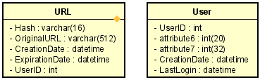

# ARSW URL Shortening Service

## Resumen

URL-Shortening-Service es una aplicación que sirve para proporcionar alias cortos que redirigen a una URL de mayor longitud.

## Descripción

Los alias cortos de url se les llama como “enlaces cortos”, estos enlaces ahorran mucho espacio cuando se muestran, imprimen, envían mensajes o tuitean y además facilita a los usuarios a escribirlas con menor probabilidad de error.

## Despliegue continuo

## Calidad de codigo

## Diagrama base de datos

## Diagrama de Casos de uso

## Requesitos y metas del sistema

### Requerimientos funcionales

 * Como usuario quiero poder obtener un alias de una url, dada una fecha de expiración y la url original para poder facilitar copiar y pegar el enlace a la página web deseada.
 
 
 
 * Como usuario quiero redirigirme a la página web que representa su url mediante una url más corta, para poder facilitar la usabilidad de un enlace mas largo.
 
 
 
 * Como usuario quiero poner un tiempo de duración del alias de una url para poder usar esta solo el tiempo que la requiero.
 
### Requerimientos no funcionales

#### El sistema debe tener una alta disponibilidad para evitar fallas en nuestras urls.

#### Despliegue:
Para este servicio se usó dos plataformas de despliegue heroku y azure app services buscando alta disponibilidad y rendimiento.

  * Heroku:Cuando se despliega una aplicación en heroku esta se ejecuta en la web dyno que se puede ver como un contenedor que ejecuta comandos, heroku esta apoyada sobre aws por garantiza buena disponibilidad y buen rendimiento sin embargo el contenedor de la aplicación siempre se pondrá en reposo después de 30 minutos de inactividad.

  * Azure app services: Esta plataforma además de ofrecernos alto rendimiento y disponibilidad, nos provee múltiples funcionalidades para el mejoramiento de nuestra aplicación como el de poder escalar vertical u horizontalmente de manera manual según lo requiramos.

#### Esquema de base de datos:
Para nuestro servicio necesitamos almacenar bastantes cantidades de datos, no necesitamos relaciones entre las tablas y requerimos que el sistema sea altamente disponible, por lo que una opción no sql es mejor. 

* MongoDb: este motor de base de datos se utilizará como el almacén de datos de las url y de los usuarios, para este proyecto se usa un clúster gratis en la nube ofrecido por mongo Atlas con ciertas limitaciones como:

  •	No elección de región (únicamente en virginia del norte)

  •	RAM compartida

  •	Almacenamiento fijo de 512 MB

  •	Ancho de banda 10 GB de entrada + 10 GB de salida por semana

  •	Máximo 100 bases de datos y 500 colecciones

* Redis: Esta base de datos se utilizará para el almacenamiento de cache pero no se opto por tenerlo localmente para no tener problemas de memoria ya que los datos de algunas url pueden quedar guardadas para siempre, en cambio hacemos uso de un clúster gratis en la nube ofrecido por redislabs.
Limitaciones:

  •	30 MB de memoria

  •	Una única base de datos dedicada

  •	Máximo 30 conexiones

#### La redirección de URL debe ocurrir en tiempo real con una latencia mínima
#### Los enlaces acortados no deben ser adivinables y no debería generarse dos o más iguales
#### El servicio debe de soportar cargas de estrés altas 
 
## Construido con:

  * [IntellJ](https://www.jetbrains.com/es-es/idea/) Entorno de desarrollo integrado para el desarrollo de programas informáticos.

  * [Maven](https://maven.apache.org/) Administrador de dependencias.

  * [Spring boot](https://spring.io/projects/spring-boot) Framework para desarrollar aplicaciones web.

  * [GitHub](https://github.com/) Sistema de control de versiones Git.

  * [Postman](https://www.postman.com/) Plataforma de colaboración para el desarrollo de API.
  
  * [Redis](https://redislabs.com/) Motor de base de datos no relacional.
  
  * [mongoDb]() Motor de base de datos no relacional
  
  * [Studio3T](https://studio3t.com/) Cliente administrador de base de datos mongo

## Autor

Edwin Yesid Rodriguez Maldonado

## Referencias

[ver](https://www.educative.io/courses/grokking-the-system-design-interview/m2ygV4E81AR)

## Licencia 

GNU GENERAL PUBLIC LICENSE
