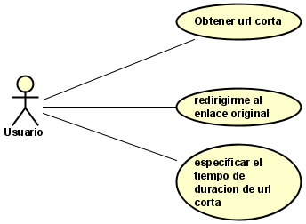

# ARSW URL Shortening Service

## Resumen

URL-Shortening-Service es una aplicación que sirve para proporcionar alias cortos que redirigen a una URL de mayor longitud.

## Descripción

Los alias cortos de url se les llama como “enlaces cortos”, estos enlaces ahorran mucho espacio cuando se muestran, imprimen, envían mensajes o tuitean y además facilita a los usuarios a escribirlas con menor probabilidad de error.

## Despliegue continuo

## Calidad de codigo

## Diagrama base de datos

## Diagrama de Casos de uso

## Requesitos y metas del sistema

### Requerimientos funcionales

 * Como usuario quiero poder obtener un alias de una url, dada una fecha de expiración y la url original para poder facilitar copiar y pegar el enlace a la página web deseada.
 
 
 
 * Como usuario quiero redirigirme a la página web que representa su url mediante una url más corta, para poder facilitar la usabilidad de un enlace mas largo.
 
 
 
 * Como usuario quiero poner un tiempo de duración del alias de una url para poder usar esta solo el tiempo que la requiero.
 
### Requerimientos no funcionales

 * La redirección de URL debe ocurrir en tiempo real con una latencia mínima
 * Los enlaces acortados no deben ser adivinables y no debería generarse dos o más iguales
 * El servicio debe de soportar cargas de estrés altas 
 
## Construido con:

  * [IntellJ](https://www.jetbrains.com/es-es/idea/) Entorno de desarrollo integrado para el desarrollo de programas informáticos.

  * [Maven](https://maven.apache.org/) Administrador de dependencias.

  * [Spring boot](https://spring.io/projects/spring-boot) Framework para desarrollar aplicaciones web.

  * [GitHub](https://github.com/) Sistema de control de versiones Git.

  * [Postman](https://www.postman.com/) Plataforma de colaboración para el desarrollo de API.
  
  * [Redis](https://redislabs.com/) Motor de base de datos no relacional.
  
  * [mongoDb]() Motor de base de datos no relacional
  
  * [Studio3T](https://studio3t.com/) Cliente administrador de base de datos mongo

## Autor

Edwin Yesid Rodriguez Maldonado

## Referencias

[ver](https://www.educative.io/courses/grokking-the-system-design-interview/m2ygV4E81AR)

## Licencia 

GNU GENERAL PUBLIC LICENSE
